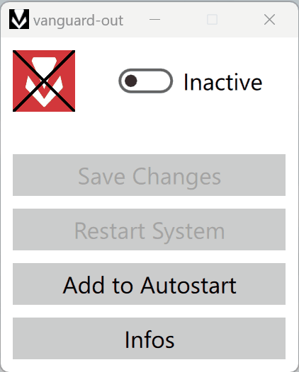

# vanguard-out
Tool to temporarily stop and disable Riot Vanguard.


## Features

Inspired by @AndrewMast scripts: [Commands to temporarily stop Riot Vanguard](https://gist.github.com/AndrewMast/742ac7e07c37096017e907b0fd8ec7bb#file-readme-md).  
If you don't like that Riot Vanguard is running in the background on your system all the time, just stop and disable it.  
The tool is not perfect, but it does the job. Feedback and suggestions are welcome.

- Disable vanguard and stop from the tray.
- Re-enable it when you want to play (restart system required).
- Add shortcut to startup folder, so vanguard is locked out on every system start.
- Restart system command included.
- Use a small command line interface.
- Or use a simple user interface.

## vanguard-cli
```
Usage: vanguard-cli.exe [OPTIONS]

Options:
  -h,--help                                       Print this help message and exit
  -v,--version                                    Display program version information and exit
  -s,--state {activate, deactivate} or {1, 0}     Set vanguard state
  -r,--restart INT:POSITIVE                       Restart system after N seconds (default: 0)
  -c,--check                                      Check current state and activate or deactivate vanguard
```

#### Examples
```
activate:                 vanguard-cli.exe --state activate
deactivate:               vanguard-cli.exe --state deactivate
activate with restart:    vanguard-cli.exe --state activate --restart
```

#### Shortcut for Startup folder with PowerShell commands
```
$WshShell = New-Object -ComObject WScript.Shell;
$ShortcutPath = "$env:APPDATA\Microsoft\Windows\Start Menu\Programs\Startup\vanguard-cli.lnk";
$Shortcut = $WshShell.CreateShortcut($ShortcutPath);
$Shortcut.TargetPath = "C:\tools\vanguard-out-0.1.0-win64\vanguard-cli.exe";
$Shortcut.WorkingDirectory = "C:\tools\vanguard-out-0.1.0-win64";
$Shortcut.Arguments = "--check";
$Shortcut.Save();
```

## vanguard-gui



## Installation
- Tested on Windows 11 with Qt version 6.7.0.
- For the portable version download the latest release from [github/tidy-images/releases](https://github.com/Simon-12/tidy-images/releases) and unzip it.
- To build from source, you can also download the source code from releases.
- `vanguard-cli`: dependency [github/CLI11](https://github.com/CLIUtils/CLI11) (no Qt required).
- `vanguard-gui`: the easiest way is to open `CMakeLists.txt` in your Qt Creator and configure with one of your installed Qt kits.
